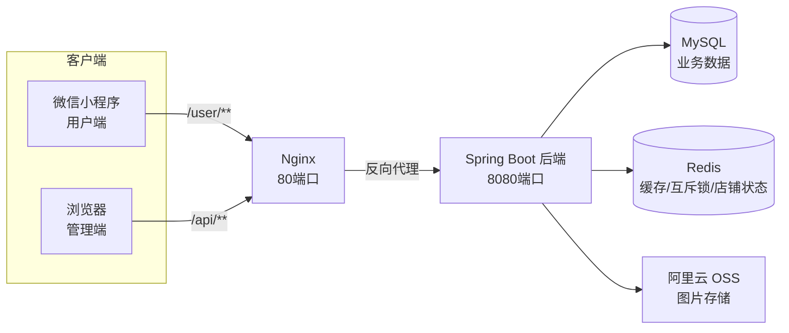

# 苍穹外卖(sky-take-out)

一个基于 Spring Boot + MyBatis + Redis 的外卖点餐系统,支持微信小程序用户端点餐与管理端运营管理,并对缓存和库存做了完整的并发防护。
(线上地址：https://hmlcode.top 「演示账号：demo / 密码:123456」)

## 架构图

## 技术栈

| 层 | 技术 |
|----|------|
| 后端 | Spring Boot 2.7.3、Spring MVC、MyBatis、PageHelper、Knife4j、WebSocket、AOP |
| 数据 | MySQL 8、Redis |
| 前端 | Vue 2(管理端)、微信小程序(用户端) |
| 部署 | Nginx、Maven |

## 核心亮点

### 1. 缓存三件套

- **缓存穿透防护**:查询结果为空时也写入缓存(短 TTL 5 分钟),避免不存在的 key 反复穿透数据库
- **缓存击穿防护**:Redis 互斥锁(SET NX EX),缓存未命中时只允许一个线程查库重建缓存,其他线程等待后读缓存;锁带过期时间、finally 释放、Lua 脚本校验 value 防止误删他人锁,重试超限降级直接查库
- **缓存雪崩防护**:缓存 TTL 随机化(55~65 分钟),避免大量缓存同时过期导致数据库被打满

### 2. 库存并发控制

菜品增加库存字段,下单时通过**原子条件更新**(`UPDATE dish SET stock = stock - n WHERE id = ? AND stock >= n`)扣减库存,库存不足下单失败并回滚事务,并发场景下不会超卖、不会扣成负数。

### 3. 压测数据

压测环境:本机 Windows 11 专业版(i7-12650H 10 核 16 线程 / 16G 内存),JMeter 200 并发,压测客户端与服务端同机运行。

**场景一:缓存穿透(查询不存在的分类)**

| 防护         | QPS    | 平均响应  | 查库 SQL |
| ---         | ---     | ---     | ---     |
| 无空值缓存    | 85.8    | 878ms  | 200 条   |
| 空值缓存     | 1036.3  | 77ms    | 1 条     |

**场景二:缓存击穿(热点 key 失效瞬间)**

| 防护    | QPS   | 平均响应 |
| ---    | ---   | ---    |
| 无互斥锁 | 59.8 | 1903ms |
| 互斥锁  | 727.3 | 135ms  |

**场景三:库存防超卖(200 并发,库存 100)**

| 防护 | 成功下单 | 库存结果 |
| --- | --- | --- |
| 无防超卖 | 200 | -99(超卖) |
| 有防超卖 | 100 | 0(未超卖) |

**缓存雪崩**:固定 TTL 会导致所有缓存同时过期,本项目通过随机 TTL(55~65 分钟)使各 key 到期时间错开,避免同时过期(未做并发压测,以机制说明为准)。

## 本地运行

### 环境要求

- **JDK 21**(项目按 JDK 21 开发编译)
- Maven 3.8+
- MySQL 8(导入 `sky_take_out` 数据库及表结构)
- Redis(本地 6379)
- Nginx(托管管理端前端)
- 微信开发者工具(运行用户端小程序)

### 启动步骤

1. 启动 MySQL 和 Redis
2. 复制 `sky-server/src/main/resources/application-dev.example.yml` 为 `application-dev.yml`,按需填写数据库账号、阿里云 OSS、微信小程序配置
3. 启动后端:运行 `com.sky.SkyApplication`(IDEA 或 `mvn spring-boot:run`)
4. 管理端:启动 Nginx,浏览器访问 `http://localhost`,接口文档见 `http://localhost:8080/doc.html`
5. 用户端:微信开发者工具导入小程序项目,使用自己的 AppID 或测试号

## 说明

基于公开教学项目《苍穹外卖》,在其之上自行实现了互斥锁防缓存击穿、缓存穿透与雪崩防护、库存扣减与并发防超卖、假支付模拟、用户端 JWT 拦截器等。
